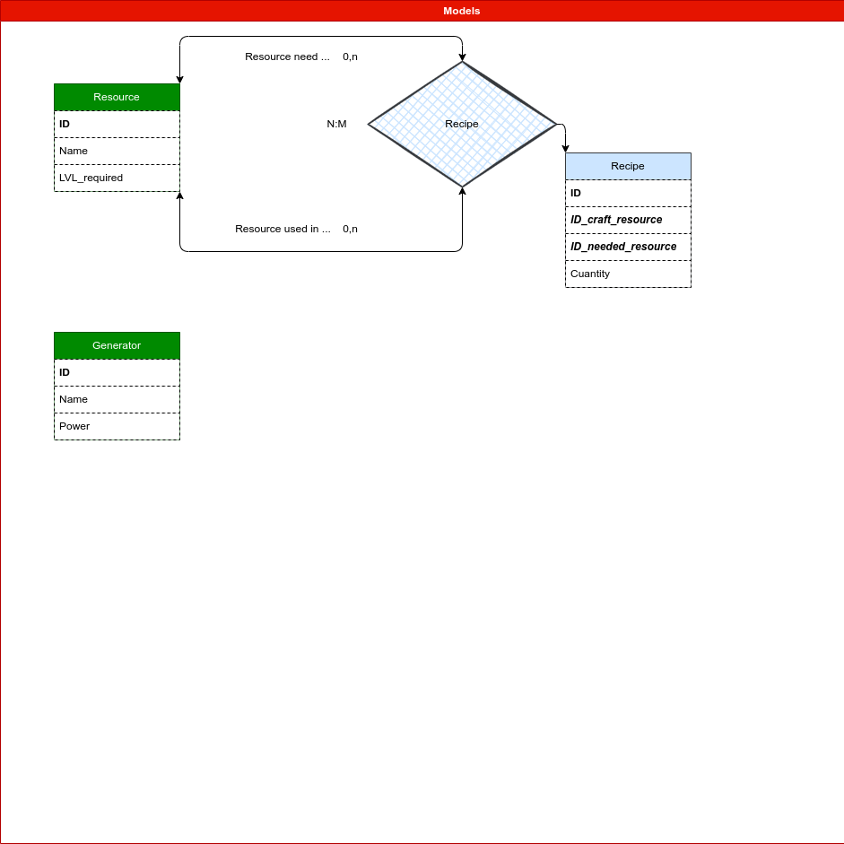
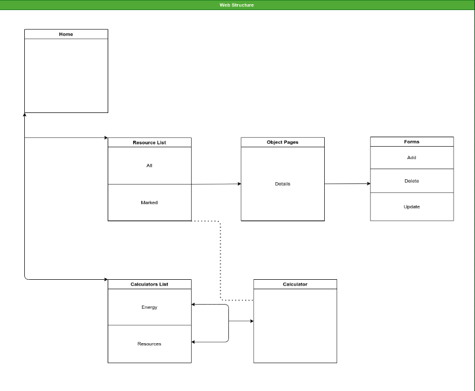

# Satisfactory

## Description 
The objective of this project, based on the videogame [satisfactory](https://www.satisfactorygame.com/),is to provide an easy calculator of the cuantity of resources needed to craft other resources.
Once calculated all the resources needed, you could mark them to save the quantity in a session.
Also give a, for the moment, very simple calculator of the energy provide from the generators of the game.

## Dessgin

### 1. Models
In this project we would use two principal models, the generators and the resources:  
- **Generator**:
   - ***ID*** <small style="color:gray">The identifier</small>
   - **Name** <small style="color:gray">Its the name of the generator</small>
   - Power <small style="color:gray">The cuantity of power generated in 100% efficiency</small>
- **Resource**: 
   - ***ID*** <small style="color:gray">The identifier</small>
   - **Name** <small style="color:gray">Name of the resource</small>
   - Messure <small style="color:gray">The messure unity: *uds* - *l* </small>
  
Also, resources will have relation with itself to know if a resource its crafted from other. We will call it relation **Recipe**.

- **Recipe**:
  - ***ID*** <small style="color:gray">The identifier of the entrie</small>
  - *ID_craft_resource* <small style="color:gray">Foreign key from resource of the resource that would be crafted.</small>
  - *ID_needed_resource* <small style="color:gray">Foreign key from resource of the resource that would be needed to craft the *craft_resource*</small>
  - Cuantity <small style="color:gray">The unity of the needed resource in the recipe of *needed_resource* per unit of *craft_resource*</small>
  

### 2. Screen Design

## Intereseting details

1. The messure field in **Resource**, it`s an enum type